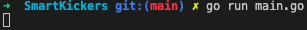
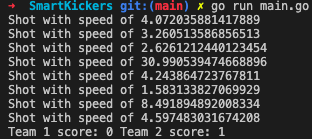

# SmartKickers

## Overview

SmartKickers is a project to make your kickers more immersive. It uses Ximea camera to track the ball. 

The following repository contains: 
* Golang server for processing the data.
* React client to display game information.
## Features

* Keeping track of the score.

## Prerequisites

* [python](https://www.python.org/downloads/macos/) in version 3.10.5 or higher
* [node](https://nodejs.org/en/download/) in version 16.16.0 or higher
* npm in version 8.11.0 or higher
* [SmartKickersAI](https://github.com/HackYourCareer/SmartKickersAI.)
## Requirements

* [ximea camera drivers](https://www.ximea.com/support/wiki/apis/ximea_macos_software_package) (macOS)
* opencv-python 

    ```bash 
    pip3 install open-cv
    ```

* numpy

    ```bash 
    pip3 install numpy
    ```

* imutils

    ```bash 
    pip3 install imutils
    ```

## Installation

We are using macOS to build and run everything locally for now.

1. Clone the repositories.

    ```bash 
    git clone git@github.com:HackYourCareer/SmartKickers.git
    git clone git@github.com:HackYourCareer/SmartKickersAI.git
    ```

2. Run the requirementsCheck.sh script to check if your system fulfils all requirements.

    The script will look for open-cv, numpy, imutils, ximer driver only after successfully installing python! So if you don't have python it won't print missing python dependent packages except python itself.

    ```bash 
    cd SmartKickers
    ./requirementsCheck.sh
    ```

    > **NOTE:** Be sure to give permission for the script to execute.

3. Install missing dependencies.

4. Switch to **SmartKickers/frontend/smart-kickers-game** and run npm install.

    ```bash 
    cd SmartKickers/frontend/smart-kickers-game
    npm install
    ```

## Launching

> **NOTE:** The configuration for the table is provided by the developers in SmartKickersAI. In the future, there will be a manual to help to customize the configuration for any table to achieve the best ball detection accuracy.

1. Switch to **SmartKickers/backend** and launch the go server.

    ```bash 
    cd SmartKickers/backend
    go run main.go
    ```

    After launching you should see no response. The server is waiting for data from the node server. We plan to add an indicator of a successful launch in the future using logrus logs.

    <h1 align="center">
        
    </h1>

2. Switch to **SmartKickersAI/LocalServer/server** and launch the node server.

    ```bash 
    cd SmartKickersAI/LocalServer/server
    node server.js
    ```
    You should see the following output indicating that we have successfully connected to the go server.

    <h1 align="center">
        
    </h1>

    After launching the node server you should see the following output from your go server.

    As we can see the last message is the score that is being send to the react app.

    <h1 align="center">
        
    </h1>

3. Switch to **SmartKickers/frontend/smart-kickers-game** and launch the react client.

    ```bash 
    npm start
    ```

    Your react app should look like this.

    > **NOTE**: The Team 1 score in the go server corresponds Blue score in the react app and Team 2 corresponds Blue.

    <h1 align="center">
        
    </h1>


## Development

More details for developers will be provided soon in separate Readme files for the frontend, backend and SmartKickersAI.