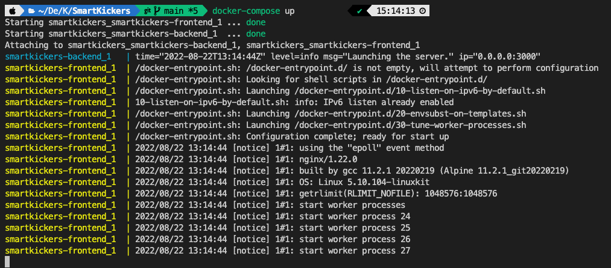
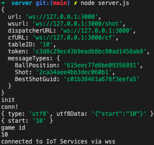
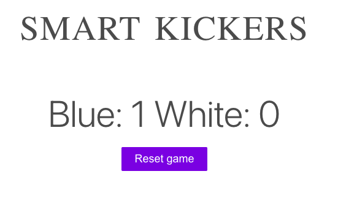

# SmartKickers

## Overview

SmartKickers is a project to make your kickers more immersive. It uses Ximea camera to track the ball.

The following repository contains:

- Golang server for processing the data.
- React client to display game information.

## Table of content

- [SmartKickers](#smartkickers)
  - [Overview](#overview)
  - [Table of content](#table-of-content)
  - [Features](#features)
  - [Prerequisites](#prerequisites)
  - [Installation](#installation)
  - [Launching](#launching)

## Features

- Keeping track of the score.
- Manually adjust the score.

## Prerequisites

Install the following:

1. [Python](https://www.python.org/downloads/) in version 3.10.5 or higher
2. [Node](https://nodejs.org/en/download/) in version 16.16.0 or higher
3. [Go](https://go.dev/dl/) in version 1.18.3 or higher
4. [SmartKickersAI](https://github.com/HackYourCareer/SmartKickersAI)
5. [Ximea camera drivers](https://www.ximea.com/support/wiki/apis/)
6. Docker API for example Docker Desktop:
   - [MacOS](https://docs.docker.com/desktop/install/mac-install/)
   - [Windows](https://docs.docker.com/desktop/install/windows-install/)
   - [Linux](https://docs.docker.com/desktop/install/linux-install/)
     > **NOTE:** Docker API is not mandatory to run the application, although it's recommended.
7. Opencv-python

   ```bash
   pip3 install opencv-python
   ```

   For **brew** users:

   ```bash
   brew install opencv
   ```

8. Numpy

   ```bash
   pip3 install numpy
   ```

   For **brew** users:

   ```bash
   brew install numpy
   ```

9. Imutils

   ```bash
   pip3 install imutils
   ```

## Installation

We are using macOS to build and run everything locally.

1. Clone the repositories.

   ```bash
   git clone https://github.com/HackYourCareer/SmartKickers.git
   git clone https://github.com/HackYourCareer/SmartKickersAI.git
   ```

2. Run the [`requirementsCheck.sh`](requirementsCheck.sh) script to check if your system fulfils all requirements.

   The script will look for open-cv, numpy, imutils, ximer driver only after successfully installing python! So if you don't have python it won't print missing python dependent packages except python itself.

   ```bash
   cd SmartKickers
   ./requirementsCheck.sh
   ```

   > **NOTE:** Be sure to give permission for the script to execute.<br/>

   ```bash
   sudo chmod +x requirementsCheck.sh
   ```

3. Install missing dependencies.

4. In folder [`SmartKickers`](SmartKickers) run docker-compose build.

   ```bash
   docker-compose build
   ```

## Launching

> **NOTE:** Configuration files for the camera view are provided by the developers in [`SmartKickersAI`](https://github.com/HackYourCareer/SmartKickersAI/tree/main/LocalServer) repository.

1. In the folder [`SmartKickers`](SmartKickers) launch the docker-compose.

   ```bash
   docker-compose up
   ```

   After launching you will see that the backend and the frontend of the application has started successfully.

   <h1 align="center">
       
   </h1>

2. Plug-in the camera wire to the computer.

3. In new terminal switch to [`SmartKickersAI/LocalServer/server`](SmartKickersAI/LocalServer/server) and launch the node server.

   ```bash
   cd SmartKickersAI/LocalServer/server
   node server.js
   ```

   You will see the following output indicating that we have successfully connected to the go server.

   <h1 align="center">
       
   </h1>

4. In the browser, go to [`localhost:3007`](http://localhost:3007/) to see the react application.

   Properly working React application looks like this.

   > **NOTE**: Team 1's score on the Go server represents the Blue Team's score in React, and Team 2's score represents the White Team's score.

      <h1 align="center">
          
      </h1>

   <!-- ## Development
   More details for developers may be provided soon in separate Readme files for the frontend, backend and SmartKickersAI. -->
