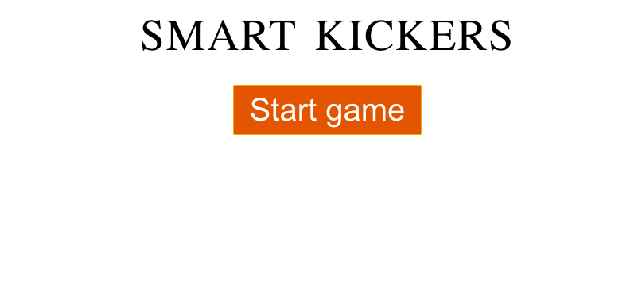

# SmartKickers

## Overview

SmartKickers is a project to make your kickers more immersive. It uses Ximea camera to track the ball. 

The following repository contains: 
* Golang server for processing the data.
* React client to display game information.

You will also need SmartKickersAI provided by the developers per request. It contains:
* Ball tracking software.
* Node server responsible for sending data to the Golang server.

Link to SmartKickerAI
https://github.com/HackYourCareer/SmartKickersAI.

## Features

* Keeping track of the score.

## Prerequirements

* [python 3.10.5](https://www.python.org/downloads/macos/)
* [node 16.16.0](https://nodejs.org/en/download/)
* npm 8.11.0
* macOS 12.4
## Requirements

* [ximea camera drivers](https://www.ximea.com/support/wiki/apis/ximea_macos_software_package)
* opencv-python 

    ```bash 
    pip3 install open-cv
    ```

* numpy

    ```bash 
    pip3 install numpy
    ```

* imutils

    ```bash 
    pip3 install imutils
    ```

## Installation

We are using macOS to build and run everything locally for now.

> **NOTE:** Ensure you have also SmartKickersAI source code.

1. Clone the repositories.

    ```bash 
    git clone git@github.com:HackYourCareer/SmartKickers.git

    git clone git@github.com:HackYourCareer/SmartKickersAI.git
    ```

2. Run the requirementsCheck.sh script to check if your system fulfils all requirements.

    ```bash 
    ./requirementsCheck.sh
    ```

    > **NOTE:** Be sure to give permission for the script to execute.

3. Install missing dependencies if any missing.

4. Switch to **SmartKickers/frontend/smart-kickers-game** and run the following command.

    ```bash 
    npm install
    ```

## Launching

> **NOTE:** The configuration for the table in SmartKickersAI is provided by the developers. In the future there will be a manual to help to customize the configuration for any table to achieve the best ball detection accuracy.

1. Switch to **SmartKickers/backend** and launch the go server.

    ```bash 
    go run main.go
    ```

    <h1 align="center">
        
    </h1>

2. Switch to **SmartKickersAI/LocalServer/server** and launch the node server.

    ```bash 
    node server.js
    ```
    <h1 align="center">
        
    </h1>

    After launching the node server you should see the following output from your go server.

    <h1 align="center">
        
    </h1>

    As we can see the last message is the score that is being send to the react app.

3. Switch to **SmartKickers/frontend/smart-kickers-game** and launch the react client.

    ```bash 
    npm start
    ```

    Your react app should look like this.

    > **NOTE**: The Team 1 score in the go server corresponds Blue score in the react app and Team 2 corresponds Blue.

    <h1 align="center">
        
    </h1>

